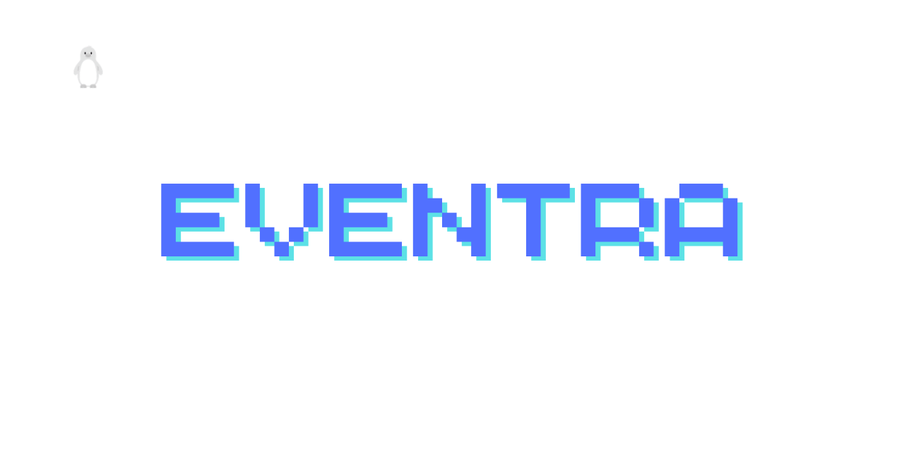
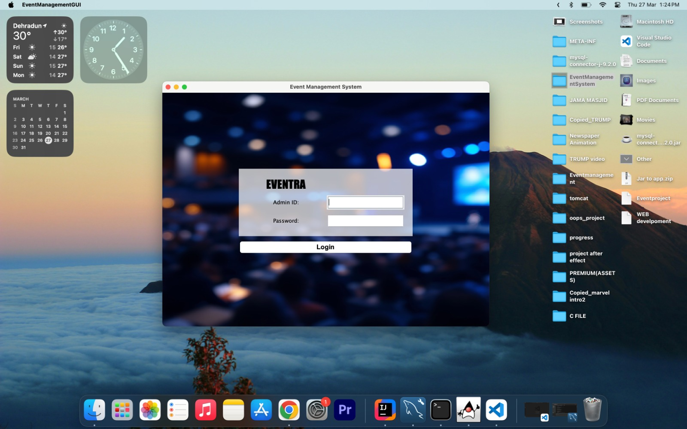
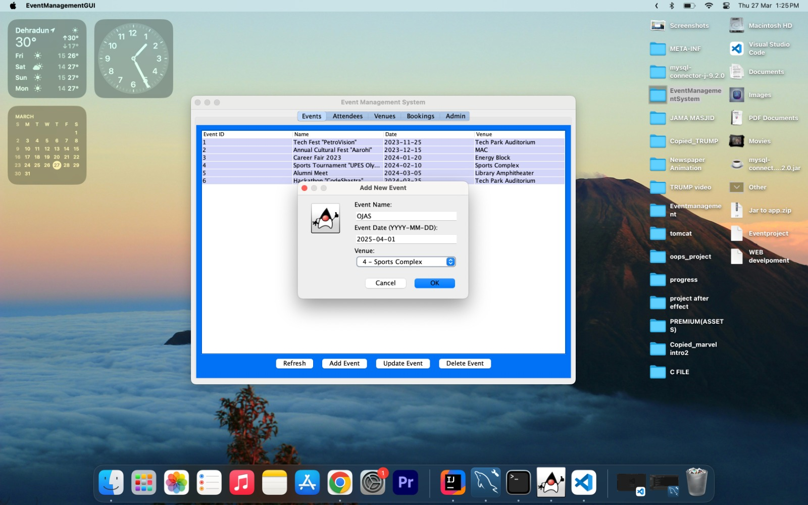
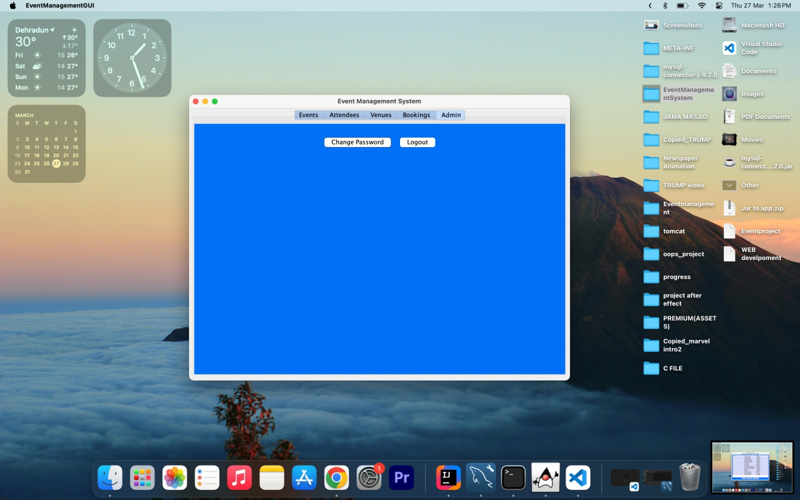

# 🎉 Event Management System



A Java-based desktop application built using **Java Swing and MySQL** that allows administrators to efficiently manage events, attendees, venues, and bookings through an interactive graphical user interface.

The system demonstrates the use of **Object-Oriented Programming principles**, **JDBC database connectivity**, and a **modular GUI architecture** to simplify event planning and administration.

---

# 📌 Project Overview

The Event Management System is designed to streamline the process of organizing and managing events through a centralized application.

The system provides:

- Secure admin login
- Event creation and management
- Venue management
- Attendee registration
- Booking management

The application uses **Java Swing for the GUI** and **MySQL as the backend database**, connected using **JDBC**.

---

# 🚀 Features

✔ Secure admin login system  
✔ Tab-based dashboard interface  
✔ CRUD operations for events, attendees, venues, and bookings  
✔ Dynamic tables using `JTable`  
✔ Interactive dialog boxes for data input  
✔ Real-time database updates and refresh functionality  
✔ Admin controls for password change and logout  

---

# 🧠 Technologies Used

### Programming Language
- Java

### Frontend
- Java Swing

### Backend
- MySQL

### Database Connectivity
- JDBC (Java Database Connectivity)

### IDE
- IntelliJ IDEA / Eclipse

---

# 🖥️ System Modules

The application contains multiple modules accessible through a **tabbed dashboard**.

### 1️⃣ Events Module
- Create new events
- Update event details
- Delete events
- View event information

### 2️⃣ Attendees Module
- Register attendees
- View attendee details
- Manage attendee records

### 3️⃣ Venues Module
- Manage venue information
- Track venue capacity and availability

### 4️⃣ Bookings Module
- Manage event bookings
- Link attendees to events

### 5️⃣ Admin Module
- Change admin password
- Logout functionality

---

# 📊 Database Structure

The system uses a relational database with the following tables:

| Table | Description |
|------|-------------|
| Admin | Stores admin login credentials |
| Events | Stores event information |
| Venues | Stores venue details |
| Attendees | Stores attendee information |
| Bookings | Links attendees to events |

Foreign key relationships maintain **data integrity between tables**. :contentReference[oaicite:1]{index=1}  

---

# ⚙️ Application Workflow

```
Admin Login
      ↓
Dashboard
      ↓
Select Module
(Events / Attendees / Venues / Bookings)
      ↓
Perform CRUD Operations
(Add / Update / Delete / View)
      ↓
Database Update via JDBC
      ↓
Table Refresh in GUI
```

---

# 📂 Project Structure

```
Event-Management-System
│
├── src
│   ├── EventManagementGUI.java
│   ├── DatabaseConnection.java
│   ├── EventModule.java
│   ├── AttendeeModule.java
│   ├── VenueModule.java
│   └── BookingModule.java
│
├── resources
│   ├── icons
│   └── background.jpg
│
├── database
│   └── event_management.sql
│
└── README.md
```

---

# 📷 Application Screenshots

## Events Management
(Add / Update / Delete Events)


## Attendees Management
(Manage registered attendees)


## Bookings Dashboard
(Manage event bookings)

## Admin Panel
(Change password / Logout)


---

# 🎯 Learning Outcomes

This project helped demonstrate:

- Object-Oriented Programming concepts
- Java Swing GUI development
- JDBC database integration
- CRUD-based application design
- MVC-style modular architecture

It also improved understanding of **GUI event handling, database design, and Java desktop application development**. :contentReference[oaicite:2]{index=2}  

---

# 👨‍💻 Authors

**Fardeen Ali**  
B.Tech CSE  
UPES Dehradun

---

# 🔮 Future Improvements

- Pagination for large datasets
- Enhanced UI components
- Role-based user management
- Web-based deployment
- Real-time event analytics

---

# 📜 License

This project is for **academic and educational purposes**.
